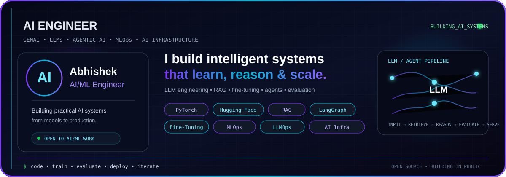
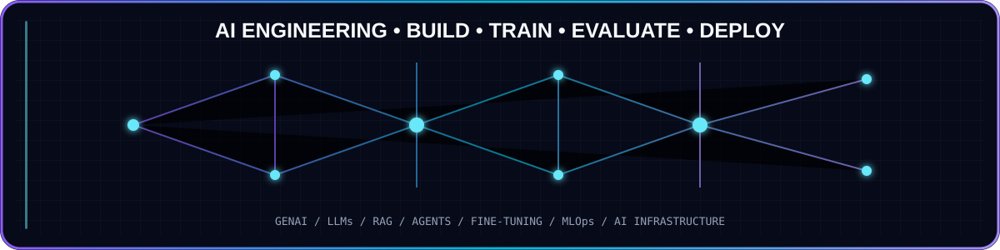

  

<h1 align="center">Hi 👋, I'm Abhishek Jaiswal

  

  

# <h1 align="center">💫 About Me
Currently working on **GenAI and LLM projects, fine-tuning models, building AI agents, improving LLM evaluation, and exploring MLOps and AI infrastructure.** 🤖 I’m looking to collaborate on **AI/ML and GenAI projects, open-source contributions, LLM applications, and practical AI systems.** 🤝 I’m looking for help with **open-source contributions, advanced LLM engineering, model evaluation, and building reliable AI systems for production.** 🚀 I’m currently learning **LLM fine-tuning, agentic AI, LLM evaluation, MLOps, LLMOps, and production AI infrastructure.** 🧠 Ask me about **AI/ML, Generative AI, LLMs, RAG, AI agents, fine-tuning, MLOps, and building production-ready AI systems.** 🤖 Fun fact: **I enjoy turning complex AI ideas into working projects and then figuring out how to make them production-ready.** 🚀 

  

  

  

# <h1 align="center"> 🌐 Socials
    

- 👨‍💻 All of my projects are available at [https://github.com/Abhijais4896](https://github.com/Abhijais4896)

- 📝 I regularly write articles on [https://dev.to/abhishekjaiswal_4896](https://dev.to/abhishekjaiswal_4896)

- 📫 How to reach me **abhishek.77647@gmail.com**

- 📄 Know about my experiences [https://www.linkedin.com/in/abhishekjaiswal076](https://www.linkedin.com/in/abhishekjaiswal076)

  

# <h1 align="center">💻 Tech Stack
                                                                   

  

<h1 align="center">💼 Work Experience</h1>

<table align="center">
<tr>
<td width="50%" valign="top">

<h3>🤖 Machine Learning Intern — Alfido Tech</h3>

<b>Dec 2025 – Jun 2026 · 06 months</b>

Worked on practical machine learning workflows involving exploratory data analysis, data cleaning, feature engineering, model development, and evaluation using real-world datasets.

<b>Focus:</b>

<code>Python</code> <code>Scikit-learn</code> <code>Machine Learning</code> 
<code>EDA</code> <code>Feature Engineering</code> <code>Model Evaluation</code> 
<code>Hyperparameter Tuning</code> <code>Data Preprocessing</code>

</td>

<td width="50%" valign="top">

<h3>🤖 Machine Learning Intern — CODTECH IT SOLUTIONS</h3>

<b>Jun 2025 – Dec 2025 · 06 months</b>

Worked on machine learning workflows covering data preprocessing, feature engineering, model training, algorithm comparison, and performance evaluation.

<b>Focus:</b>

<code>Python</code> <code>Scikit-learn</code> <code>Machine Learning</code> 
<code>Data Preprocessing</code> <code>Feature Engineering</code> <code>Model Training</code> 
<code>Hyperparameter Tuning</code> <code>Model Evaluation</code>

</td>
</tr>
</table>

  

<h1 align="center">🌟 AI/ML Portfolio Projects</h1>

<table>
<tr>

<td width="50%" valign="top">

### 🩺 Medicare — Multimodal AI Healthcare Assistant

**Multimodal AI • LLM • Voice & Vision**

A multimodal AI healthcare assistant that combines vision, voice, and LLM capabilities to provide interactive AI-powered responses from text, speech, and image inputs.

**Stack:**  
`Llama 3 Vision` `Whisper` `Groq` `ElevenLabs` `Gradio`

🔹 Vision-Language AI  
🔹 Speech-to-Text Integration  
🔹 LLM-Based Response Generation  
🔹 Text-to-Speech  
🔹 Interactive AI Interface

<a href="YOUR_REPO_LINK">🔗 View Project</a>

</td>

<td width="50%" valign="top">

### 📚 Enterprise Advanced RAG Platform

**RAG • LLM Evaluation • LLMOps**

An enterprise-oriented RAG platform designed for reliable LLM applications with contextual retrieval, guardrails, evaluation, caching, and centralized LLM access.

**Stack:**  
`Python` `LangChain` `LLMs` `Vector DB` `FastAPI`

🔹 Retrieval-Augmented Generation  
🔹 LLM Guardrails  
🔹 LLM Evaluation  
🔹 Response Caching  
🔹 LLM Gateway

<a href="YOUR_REPO_LINK">🔗 View Project</a>

</td>

</tr>

<tr>

<td width="50%" valign="top">

### 🤖 Multi-Agent AI System

**Agentic AI • Multi-Agent Systems • LLM**

A multi-agent AI system where specialized agents collaborate to break down complex tasks, use external tools, and coordinate their results through structured workflows.

**Stack:**  
`LangGraph` `LangChain` `Groq` `Tavily` `Python`

🔹 Multi-Agent Orchestration  
🔹 Tool Calling  
🔹 Agent Workflows  
🔹 LLM-Based Reasoning  
🔹 Automated Task Execution

<a href="YOUR_REPO_LINK">🔗 View Project</a>

</td>

<td width="50%" valign="top">

### 🧠 Fine-Tuned Text-to-SQL LLM

**LLM Fine-Tuning • LoRA • GPU Inference**

Fine-tuned an open-source LLM for natural-language-to-SQL generation using parameter-efficient fine-tuning, then deployed the model for GPU-based production inference.

**Stack:**  
`Python` `PyTorch` `Hugging Face` `PEFT` `LoRA` `vLLM` `AKS`

🔹 LoRA Fine-Tuning  
🔹 Text-to-SQL Generation  
🔹 Parameter-Efficient Training  
🔹 vLLM Model Serving  
🔹 NVIDIA GPU Operator

<a href="YOUR_REPO_LINK">🔗 View Project</a>

</td>

</tr>

<tr>

<td width="50%" valign="top">

### 📈 RAG-Based Investor Intelligence Platform

**RAG • AI Research • LLM Applications**

An AI-powered investor intelligence platform that retrieves and synthesizes relevant company and financial information to support faster research and investment analysis.

**Stack:**  
`Python` `LangChain` `LLMs` `RAG` `Vector DB`

🔹 Intelligent Information Retrieval  
🔹 Financial Data Analysis  
🔹 Context-Aware LLM Responses  
🔹 Document & Knowledge Retrieval  
🔹 AI-Assisted Investment Research

<a href="YOUR_REPO_LINK">🔗 View Project</a>

</td>

<td width="50%" valign="top">

### 🧪 Water Potability Prediction — MLOps

**Machine Learning • MLOps • Model Lifecycle**

An end-to-end machine learning system for water potability prediction with reproducible training, dataset versioning, experiment tracking, and cloud-based deployment.

**Stack:**  
`Python` `Scikit-learn` `DVC` `MLflow` `Docker` `AWS`

🔹 Data & Model Versioning  
🔹 Experiment Tracking  
🔹 Feature Engineering  
🔹 Model Evaluation  
🔹 Reproducible ML Pipeline

<a href="YOUR_REPO_LINK">🔗 View Project</a>

</td>

</tr>

</table>

  

<h1 align="center">🛡️Kaggle Profile</h1>

  

  

<h1 align="center">📱 Certifications</h1>

  

  

  

   

  

  

  

   

  

  

  

# <h1 align="center">📊 GitHub Stats
 
 

  

# <h1 align="center">🏆 GitHub Trophies

  

### <h1 align="center">✍️ Random Dev Quote

### <h1 align="center">🔝 Top Contributed Repo

  

  

