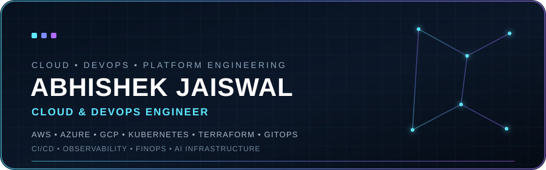

  

  

<h1 align="center">Hi 👋, I'm Abhishek Jaiswal

# <h1 align="center">💫 About Me
🚀 I am currently working on "cloud-native DevOps and AI Infrastructure projects", focusing on "Kubernetes, AWS, Azure, GCP, Terraform, GitOps, CI/CD, observability, FinOps, and platform engineering", while exploring "GPU infrastructure, model serving, MLOps, and AIOps".  🤝 I am looking to collaborate on "open-source projects, cloud-native DevOps, Kubernetes, Platform Engineering, GitOps, AI Infrastructure, MLOps, and AIOps", while working with others to build "scalable, reliable, and production-ready systems".  🔍 I am looking for help with "advanced Kubernetes, Platform Engineering, Cloud Infrastructure, AI Infrastructure, and open-source contributions", while learning from experienced engineers and collaborating on real-world DevOps challenges.  📚 I am currently learning "advanced Kubernetes, Platform Engineering, Multi-Cloud, GitOps, Observability, FinOps, and AI Infrastructure", with a focus on "GPU workloads, model serving, MLOps, and AIOps".  💬 Ask me about "Kubernetes, Cloud & DevOps, Platform Engineering, GitOps, AI Infrastructure, MLOps, AIOps, FinOps, or open-source contributions."  😄 **Fun Fact:** I enjoy turning complex infrastructure problems into automated solutions—and I’m always curious about what happens when you put **AI + Kubernetes + DevOps** together.   

  

# <h1 align="center"> 🌐 Socials
   

- 👨‍💻 All of my projects are available at [https://github.com/Abhijais4896](https://github.com/Abhijais4896)

- 📝 I regularly write articles on [https://dev.to/abhishekjaiswal_4896](https://dev.to/abhishekjaiswal_4896)

- 📫 How to reach me **abhishek.77647@gmail.com**

- 📄 Know about my experiences [https://www.linkedin.com/in/abhishekjaiswal076](https://www.linkedin.com/in/abhishekjaiswal076)

  
# <h1 align="center">💻 Tech Stack
                                                                         

<h1 align="center">💼 Work Experience</h1>

<table align="center">
<tr>
<td width="50%" valign="top">

<h3>☁️ DevOps Intern — Alfido Tech</h3>

<b>Jan 2026 – Jul 2026 · 06 months</b>

Worked on cloud infrastructure and DevOps workflows, supporting CI/CD automation, containerization, Kubernetes deployments, and AWS infrastructure management.

<b>Focus:</b>

<code>AWS</code> <code>Kubernetes</code> <code>Docker</code> 
<code>Terraform</code> <code>GitHub Actions</code> <code>Jenkins</code> 
<code>CI/CD</code> <code>IaC</code> <code>Linux</code>

</td>

<td width="50%" valign="top">

<h3>☁️ DevOps Intern — CODTECH IT SOLUTIONS</h3>

<b>Jun 2025 – Dec 2025 · 06 months</b>

Worked on Azure-based DevOps workflows, supporting CI/CD automation, infrastructure provisioning, containerization, and Kubernetes deployments.

<b>Focus:</b>

<code>Azure</code> <code>Azure DevOps</code> <code>AKS</code> 
<code>Docker</code> <code>Terraform</code> <code>CI/CD</code> 
<code>IaC</code> <code>Azure VMs</code> <code>Azure Storage</code>

</td>
</tr>
</table>

<h1 align="center">🌟 Portfolio Projects</h1>
<table>
<tr>

<td width="50%" valign="top">

### ☁️ Cloud Cost Intelligence Platform

**FinOps • AWS • Cloud Optimization**

An intelligent FinOps platform that analyzes AWS infrastructure usage and identifies opportunities to reduce unnecessary cloud spending.

**Stack:**  
`AWS` `Python` `Terraform` `Prometheus` `Grafana`

🔹 AWS Resource & Cost Analysis  
🔹 Idle & Underutilized Resource Detection  
🔹 Kubernetes Cost Insights  
🔹 AI-Powered Recommendations  
🔹 FinOps Dashboard

<a href="YOUR_REPO_LINK">🔗 View Project</a>

</td>

<td width="50%" valign="top">

### 🚀 Cloud-Native Microservices Platform

**AWS • Kubernetes • DevOps • GitOps**

A production-oriented microservices platform deployed on Amazon EKS with automated infrastructure, CI/CD, GitOps, security scanning, and observability.

**Stack:**  
`AWS EKS` `Terraform` `Docker` `Argo CD` `GitHub Actions` `Trivy`

🔹 Infrastructure as Code  
🔹 GitOps Deployments  
🔹 Automated CI/CD  
🔹 Container Security  
🔹 Kubernetes Observability

<a href="YOUR_REPO_LINK">🔗 View Project</a>

</td>

</tr>

<tr>

<td width="50%" valign="top">

### 🛠️ AI Kubernetes Incident Response Agent

**AIOps • Kubernetes • Local LLM**

An offline AI agent that investigates Kubernetes failures by analyzing pod logs, events, and resource configurations to diagnose common incidents.

**Stack:**  
`Kubernetes` `Python` `Ollama` `LLMs` `FastAPI`

🔹 CrashLoopBackOff Diagnosis  
🔹 Kubernetes API Integration  
🔹 Root Cause Analysis  
🔹 Automated Troubleshooting  
🔹 Remediation Recommendations

<a href="YOUR_REPO_LINK">🔗 View Project</a>

</td>

<td width="50%" valign="top">

### 🤖 Multi-Agent LLMOps Platform

**LLMOps • AI Agents • Cloud Deployment**

A cloud-native multi-agent platform with automated CI/CD, quality checks, containerized deployment, and AI workflow observability.

**Stack:**  
`LangGraph` `Groq` `Tavily` `Pydantic AI` `Jenkins` `ECS Fargate`

🔹 Multi-Agent Orchestration  
🔹 Automated CI/CD  
🔹 Dockerized AI Workloads  
🔹 LLM Tracing & Evaluation  
🔹 Agent Monitoring

<a href="YOUR_REPO_LINK">🔗 View Project</a>

</td>

</tr>

<tr>

<td width="50%" valign="top">

### 🔭 AI-Powered Kubernetes Observability

**SRE • OpenTelemetry • AI Observability**

An AI-assisted observability platform for Kubernetes microservices that combines distributed telemetry with intelligent incident investigation.

**Stack:**  
`Kubernetes` `OpenTelemetry` `Honeycomb` `MCP` `Python`

🔹 Distributed Tracing  
🔹 Metrics & Logs  
🔹 AI-Assisted Investigation  
🔹 Root Cause Analysis  
🔹 Service Performance Insights

<a href="YOUR_REPO_LINK">🔗 View Project</a>

</td>

<td width="50%" valign="top">

### 🧪 End-to-End MLOps Pipeline

**MLOps • Model Lifecycle • AWS**

A reproducible ML pipeline for water potability prediction with dataset versioning, experiment tracking, containerized inference, and AWS deployment.

**Stack:**  
`Python` `DVC` `MLflow` `Docker` `AWS` `FastAPI`

🔹 Dataset & Model Versioning  
🔹 Experiment Tracking  
🔹 Model Evaluation  
🔹 Reproducible Training  
🔹 Cloud Model Deployment

<a href="YOUR_REPO_LINK">🔗 View Project</a>

</td>

</tr>

</table>

<h1 align="center">📱 Certifications</h1>

  

  

  

   

  

  

  

   

  

  

# <h1 align="center">📊 GitHub Stats
 
 

# <h1 align="center">🏆 GitHub Trophies

### <h1 align="center">✍️ Random Dev Quote

### <h1 align="center">🔝 Top Contributed Repo

---

