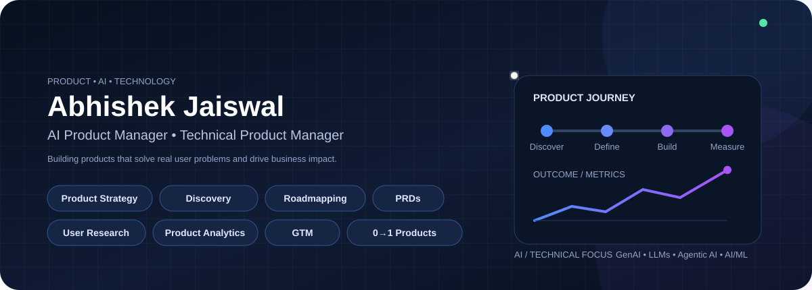
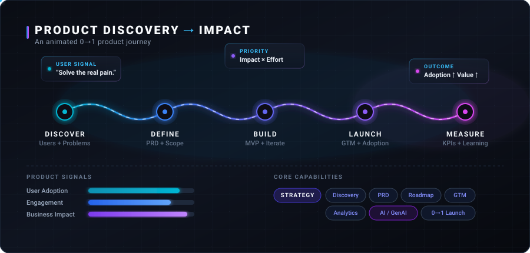

  

<h1 align="center">Hi 👋, I'm Abhishek Jaiswal

  

  

# <h1 align="center">💫 About Me
🚀 I’m currently working on 0→1 AI & technical products, focusing on product discovery, strategy, user research, roadmapping, and building solutions around real user problems. 🤝 **I’m looking to collaborate on AI/technical products, open-source projects, product strategy, 0→1 ideas, user research, and innovative solutions to real-world problems.** 🧭 **I’m looking for help with product discovery, validating ideas, building better AI products, and learning from experienced product builders and open-source communities.** 📚 **I’m currently learning AI Product Management, product strategy, user research, product analytics, SQL, Generative AI, LLMs, and agentic AI.** 💬 **Ask me about AI Product Management, 0→1 product ideas, product strategy, Generative AI, technical products, open source, or building products from scratch.** 🎯 **Fun fact:** I can spend hours turning a messy problem into a clear product idea—and somehow end up making a PRD for it. 😄 

  

  

  

# <h1 align="center"> 🌐 Socials
    

- 👨‍💻 All of my projects are available at [https://github.com/Abhijais4896](https://github.com/Abhijais4896)

- 📝 I regularly write articles on [https://dev.to/abhishekjaiswal_4896](https://dev.to/abhishekjaiswal_4896)

- 📫 How to reach me **abhishek.77647@gmail.com**

- 📄 Know about my experiences [https://www.linkedin.com/in/abhishekjaiswal076](https://www.linkedin.com/in/abhishekjaiswal076)

  

# <h1 align="center">💻 Tech Stack
                                                                                                         

  

<h1 align="center">💼 Work Experience</h1>

<table align="center">
<tr>

<!-- ═════════════════════ ALFIDO TECH ═════════════════════ -->
<td width="50%" valign="top">

<h2>🤖 Machine Learning Intern</h2>

<h3>Alfido Tech</h3>

  
  

📍 <b>Hyderabad, India · Remote</b>

Contributed to practical <b>Machine Learning</b> projects using real-world datasets, working across the workflow from data preparation and analysis to model development and evaluation.

<h4>🚀 What I Worked On</h4>

🔹 Exploratory Data Analysis 
🔹 Data Cleaning & Preprocessing 
🔹 Feature Engineering 
🔹 ML Model Development 
🔹 Model Comparison & Evaluation 
🔹 Hyperparameter Tuning

<h4>🧰 Technical Skills</h4>

<h4>💡 Product-Relevant Skills</h4>

📊 Data-driven thinking · 🔍 Problem analysis · 📈 Model evaluation

</td>

<!-- ═════════════════════ CODTECH ═════════════════════ -->
<td width="50%" valign="top">

<h2>📊 Business Analyst Intern</h2>

<h3>CODTECH IT SOLUTIONS</h3>

  
  

📍 <b>Hyderabad, India · Remote</b>

Worked with the team to understand <b>business requirements</b>, gather stakeholder inputs, document requirements, and identify opportunities to improve existing workflows and processes.

<h4>🚀 What I Worked On</h4>

🔹 Requirements Gathering 
🔹 Business & Process Analysis 
🔹 Stakeholder Discussions 
🔹 Requirements Documentation 
🔹 Feature Discussions 
🔹 Testing & Feedback

<h4>🧰 Core Skills</h4>

<h4>💡 Product-Relevant Skills</h4>

🎯 Requirements · 🤝 Stakeholders · 🔎 Process Improvement · 🧪 Testing

</td>

</tr>
</table>

 

  

<!-- ═══════════════════════════════════════════════════════════ -->
<!--                    PRODUCT PROJECTS                        -->
<!-- ═══════════════════════════════════════════════════════════ -->

<h1 align="center">🚀 Product Management Projects</h1>

  <i>Exploring real-world problems through product discovery, strategy, UX, and 0→1 product development.</i>

 

<table align="center">
<tr>

<!-- ═══════════════════ AI CUSTOMER SUPPORT ═══════════════════ -->

<td width="50%" valign="top">

<h2>💬 AI Customer Support Agent</h2>

Designed an AI-powered customer support solution focused on reducing repetitive work and helping support teams respond to customers more efficiently.

<h4>🎯 Product Focus</h4>

🔹 Customer intent detection 
🔹 Support email workflows 
🔹 Automated response drafting 
🔹 Human escalation workflows 
🔹 Support efficiency

<h4>🧠 PM Skills</h4>

<code>Product Discovery</code>
<code>User Journey</code>
<code>Workflow Design</code> 
<code>Requirements</code>
<code>Prioritization</code>
<code>UX Thinking</code>

</td>

<!-- ═══════════════════ AI RECRUITMENT ═══════════════════ -->

<td width="50%" valign="top">

<h2>👥 AI Recruitment & CRM</h2>

Designed an AI-powered recruitment CRM to simplify candidate management, hiring pipelines, recruiter workflows, and communication.

<h4>🎯 Product Focus</h4>

🔹 Candidate management 
🔹 Hiring pipeline design 
🔹 Recruiter workflows 
🔹 Candidate search 
🔹 AI-assisted recruitment

<h4>🧠 PM Skills</h4>

<code>Product Strategy</code>
<code>Discovery</code>
<code>PRDs</code> 
<code>User Journeys</code>
<code>Feature Prioritization</code>
<code>Workflow Design</code>

</td>

</tr>

<tr>

<!-- ═══════════════════ AI DEVOPS ═══════════════════ -->

<td width="50%" valign="top">

<h2>⚙️ AI-Powered DevOps Team</h2>

Designed an AI-powered DevOps platform to help engineering teams detect incidents, investigate issues, identify root causes, and automate repetitive operational tasks.

<h4>🎯 Product Focus</h4>

🔹 Incident detection 
🔹 Root-cause analysis 
🔹 Troubleshooting workflows 
🔹 Automated remediation 
🔹 Human + AI collaboration

<h4>🧠 PM Skills</h4>

<code>Technical Product Management</code>
<code>Product Discovery</code> 
<code>Workflow Design</code>
<code>Prioritization</code>
<code>Technical Requirements</code>

</td>

<!-- ═══════════════════ FINANCE SAAS ═══════════════════ -->

<td width="50%" valign="top">

<h2>💰 AI-Powered Finance SaaS</h2>

Designed a personal finance SaaS concept focused on making income and expense tracking simpler while helping users understand their spending.

<h4>🎯 Product Focus</h4>

🔹 Receipt scanning 
🔹 Expense categorization 
🔹 Financial summaries 
🔹 Spending insights 
🔹 CSV data export

<h4>🧠 PM Skills</h4>

<code>Product Strategy</code>
<code>User Research</code>
<code>User Journey</code> 
<code>Feature Prioritization</code>
<code>UX Thinking</code>
<code>Metrics</code>

</td>

</tr>

<tr>

<!-- ═══════════════════ ECOMMERCE ═══════════════════ -->

<td width="50%" valign="top">

<h2>🛒 Multi-Vendor E-commerce</h2>

Designed a multi-vendor marketplace covering customer, seller, and admin workflows across the complete buying and selling journey.

<h4>🎯 Product Focus</h4>

🔹 Vendor onboarding 
🔹 Product management 
🔹 Orders & payments 
🔹 Customer support 
🔹 Admin workflows

<h4>🧠 PM Skills</h4>

<code>Product Strategy</code>
<code>Customer Journey</code>
<code>Marketplace Design</code> 
<code>Requirements</code>
<code>Prioritization</code>
<code>AI Product Thinking</code>

</td>

<!-- ═══════════════════ PM CAPABILITIES ═══════════════════ -->

<td width="50%" valign="middle" align="center">

<h2>🧩 Product Toolkit</h2>

 

<b>Problem → Discovery → Strategy → 
Solution → Launch → Measurement</b>

</td>

</tr>
</table>

 

  
  
  

  

<h1 align="center">🛡️Published Products</h1>

  

<h1 align="center">📱 Certifications</h1>

  

  

  

   

  

  

  

   

  

  

  

# <h1 align="center">📊 GitHub Stats
 
 

  

# <h1 align="center">🏆 GitHub Trophies

/////---> animated GitHub trophies

  

### <h1 align="center">✍️ Random Dev Quote

### <h1 align="center">🔝 Top Contributed Repo

//////----> animated contributed repo

  

//////----> ANIMATED PIPELINE OR TERMINAL FOR PM

  

