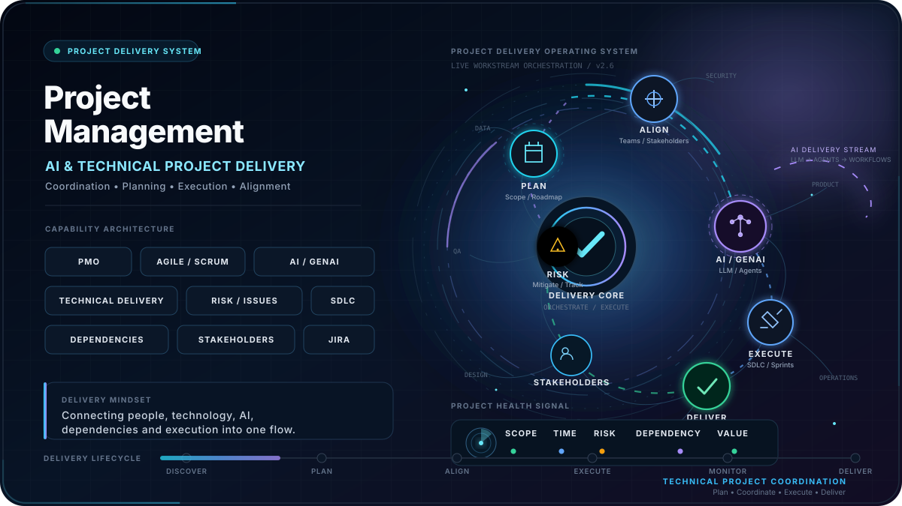
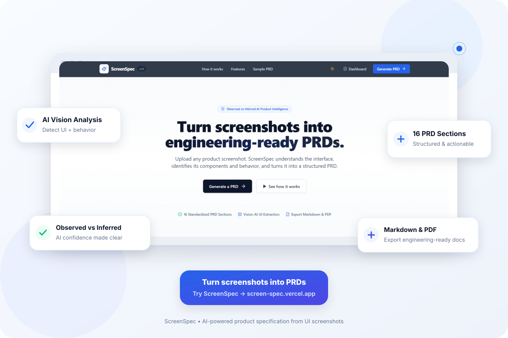
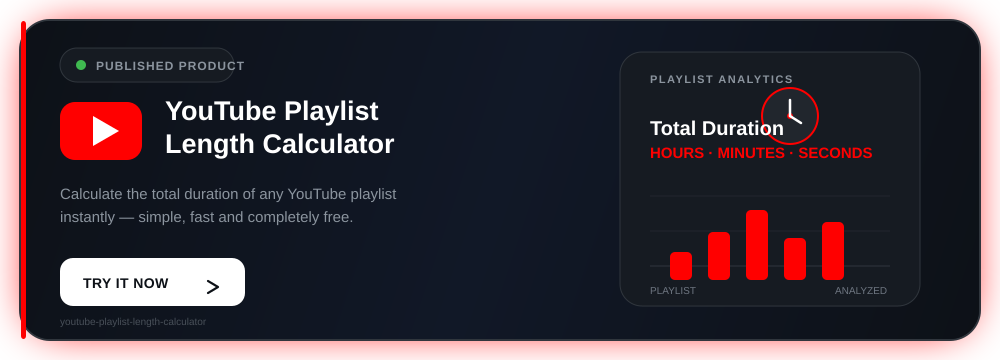
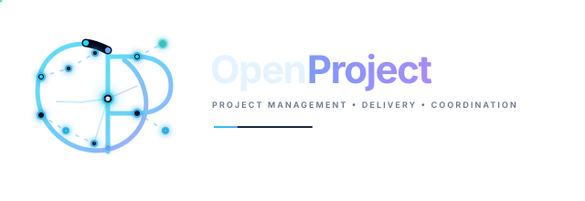
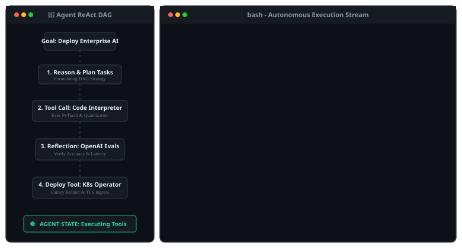

  

<h1 align="center">Hi 👋, I'm Abhishek Jaiswal

  

  

# <h1 align="center">💫 About Me
🚀 I am currently working on technical and AI-focused project management projects, including ☁️ enterprise cloud migration, 🤖 GenAI implementation, 🏦 digital banking transformation, and 🌍 multi-country ERP implementation. I’m also building projects around 📊 AI-powered analytics, 🧩 product development, and 📋 end-to-end project delivery to strengthen my technical project and program management skills. 🤝 I am looking to collaborate on 🚀 technical project & program management, 🤖 AI/GenAI implementations, ☁️ cloud transformation, 📊 data & analytics projects, and 🌍 open-source initiatives. I’m especially interested in working with people who enjoy solving real-world problems, improving project delivery, and building scalable technology solutions. 🧭 I am looking for help with improving my skills in 🚀 technical project & program management, 🤖 AI/GenAI project delivery, ☁️ cloud transformation, 📊 data-driven decision-making, and 📈 building scalable, real-world technology projects. I’m also open to learning from experienced professionals and collaborating on challenging projects. 📚 I am currently learning 🚀 Technical Project & Program Management, 🤖 AI/GenAI, ☁️ Cloud & Digital Transformation, 📊 Data Analytics, 🔄 Agile & Scrum, and 🧩 modern tools and practices for effective technology project delivery. 💬 Ask me about 🚀 Technical Project & Program Management, 🤖 AI/GenAI projects, ☁️ Cloud & Digital Transformation, 📊 Data & Analytics, 📋 Agile project delivery, and 🌍 building real-world technology projects. 🤖 I enjoy turning complex technology ideas into structured, practical projects — and I’m always looking for the next challenge to build, learn, and improve. 🚀

  

  

# <h1 align="center"> 🌐 Socials

- 👨‍💻 All of my projects are available at [https://github.com/Abhijais4896](https://github.com/Abhijais4896)

- 📝 I regularly write articles on [https://dev.to/abhishekjaiswal_4896](https://dev.to/abhishekjaiswal_4896)

- 📫 How to reach me **abhishek.77647@gmail.com**

- 📄 Know about my experiences [https://www.linkedin.com/in/abhishekjaiswal076](https://www.linkedin.com/in/abhishekjaiswal076)
  
- 🌟 My Portfolio [https://abhishekjaiswal-pmportfolio.vercel.app/](https://abhishekjaiswal-pmportfolio.vercel.app/)

  

 

# 💻 Tech Stack:
                                                                                   

  

<h1 align="center">💼 Work Experience</h1>

  

  
  
  

<table>
  <tr>
    <th colspan="2" align="center">🚀 PROFESSIONAL EXPERIENCE</th>
  </tr>
  <tr>
    <td width="30%" align="center" valign="top">
      
        
      <b>Junior Product Manager</b>
       
      E-commerce
        
      
        
      
       
      📍 Remote · Noida, India
        
      
    </td>
    <td valign="top">
      **🎯 Focus: Product Discovery · Customer Experience · Feature Coordination**
      <ul>
        <li>🛍️ Supported analysis of user needs and friction points across the e-commerce journey, from product discovery to checkout.</li>
        <li>📝 Helped document product requirements, user stories, and feature ideas while coordinating implementation details with design and development teams.</li>
        <li>📊 Reviewed product views, add-to-cart rates, checkout completion, and user feedback to identify shopping experience improvements.</li>
      </ul>
      **🧰 Skills**
        
      
      
      
      
    </td>
  </tr>
  <tr>
    <td colspan="2">
</td>
  </tr>
  <tr>
    <td width="30%" align="center" valign="top">
      
        
      <b>Business Analytics Intern</b>
        
      
        
      
       
      📍 Remote · Hyderabad, India
        
      
    </td>
    <td valign="top">
      **🎯 Focus: Business Intelligence · KPI Tracking · Reporting**
      <ul>
        <li>🔍 Worked with business and product teams to understand requirements, document processes, and translate business needs into actionable team tasks.</li>
        <li>📈 Analyzed operational data using Excel and SQL, tracking order volume, conversion rates, and turnaround time to identify trends and recurring issues.</li>
        <li>📑 Prepared recurring reports and dashboards to reduce manual reporting effort and improve weekly business update turnaround.</li>
      </ul>
      **🧰 Skills**
        
      
      
      
      
      
    </td>
  </tr>
  <tr>
    <td colspan="2">
</td>
  </tr>
  <tr>
    <td width="30%" align="center" valign="top">
      
        
      <b>Machine Learning Intern</b>
        
      
        
      
       
      📍 Remote · Hyderabad, India
        
      
    </td>
    <td valign="top">
      **🎯 Focus: Data Preparation · Model Evaluation · Experimentation**
      <ul>
        <li>🧹 Prepared datasets using Python and pandas, addressing missing values, duplicates, outliers, and basic feature engineering.</li>
        <li>🧠 Trained and compared classification and regression models using scikit-learn and metrics such as precision, recall, F1-score, and RMSE.</li>
        <li>📋 Documented experiments and model results while identifying opportunities to improve data quality and model performance.</li>
      </ul>
      **🧰 Skills**
        
      
      
      
      
    </td>
  </tr>
  <tr>
    <td colspan="2">
</td>
  </tr>
  <tr>
    <td width="30%" align="center" valign="top">
      
        
      <b>Backend Developer Intern</b>
        
      
        
      
       
      📍 Remote · New Delhi, India
    </td>
    <td valign="top">
      **🎯 Focus: API Development · Database Operations · Testing**
      <ul>
        <li>⚙️ Assisted in developing and testing Python backend APIs, including request handling, validation, and basic CRUD operations.</li>
        <li>🗄️ Worked with databases to store, retrieve, and update application data while helping troubleshoot common API and database issues.</li>
        <li>🧪 Tested API endpoints, fixed bugs, and documented implementation details in coordination with the development team.</li>
      </ul>
      **🧰 Skills**
        
      
      
      
      
    </td>
  </tr>
  <tr>
    <td colspan="2">
</td>
  </tr>
  <tr>
    <td width="30%" align="center" valign="top">
      
        
      <b>Data Science Intern</b>
        
      
        
      
       
      📍 Remote · Telangana, India
    </td>
    <td valign="top">
      **🎯 Focus: Exploratory Data Analysis · Visualization · Model Experiments**
      <ul>
        <li>🧹 Cleaned and explored datasets using Python, pandas, and NumPy to assess data quality, distributions, and emerging patterns.</li>
        <li>📊 Performed exploratory data analysis and created visualizations with Matplotlib and Seaborn to communicate findings.</li>
        <li>🔬 Assisted with feature preparation and machine learning experiments, comparing model results using appropriate evaluation metrics and documenting findings.</li>
      </ul>
      **🧰 Skills**
        
      
      
      
      
      
    </td>
  </tr>
</table>

  
    
  <b>🌱 Continuous Learning · 🤝 Cross-Functional Collaboration · 🚀 Practical Problem-Solving</b>
   
  <i>Connecting business requirements, analytical insights, and technology delivery.</i>

  

<h1 align="center">🚀 Portfolio Projects</h1>

  

<table>
<tr>
<td width="50%" valign="top">

### 🏦 Digital Banking Transformation

**Digital Transformation Program**

📅 `2026`   🌐 `Enterprise`

> **Objective:** Transform the digital banking journey and improve customer experience.

**⚡ Project Work**

* 🧭 Mapped onboarding, authentication, payments & support journeys.
* 🗂️ Defined transformation workstreams, milestones & ownership.
* 📊 Established adoption, transaction & onboarding KPIs.

**🔑 Core Areas**

`Digital Transformation` `Process Mapping`
`Program Planning` `KPI Management` `Stakeholder Coordination`

 

</td>

<td width="50%" valign="top">

### ☁️ Enterprise Cloud Migration

**Cloud Transformation Project**

📅 `2026`   🌐 `Enterprise`

> **Objective:** Plan and coordinate a phased migration of enterprise applications, data & infrastructure.

**⚡ Project Work**

* 🗺️ Created scope, milestones, dependencies & migration phases.
* 📋 Built trackers for tasks, risks, issues & delivery status.
* 🛡️ Developed communication plan & enterprise risk register.

**🔑 Core Areas**

`Cloud Migration` `Project Planning`
`Risk Management` `Dependency Tracking` `Business Continuity`

 

</td>
</tr>

<tr>
<td width="50%" valign="top">

### 🤖 Enterprise GenAI Adoption

**AI Implementation Program**

📅 `2026`   🤖 `GenAI`

> **Objective:** Build a structured framework for enterprise GenAI adoption and implementation.

**⚡ Project Work**

* 🔎 Evaluated & prioritized GenAI use cases.
* 🚀 Designed pilot → testing → training → rollout roadmap.
* 🛡️ Established AI governance for privacy, security & responsible AI.

**🔑 Core Areas**

`GenAI Strategy` `AI Governance`
`Use-Case Prioritization` `Implementation Roadmap` `Change Adoption`

 

</td>

<td width="50%" valign="top">

### 🌍 Global ERP Implementation

**Multi-Country Rollout Program**

📅 `2026`   🌐 `Global`

> **Objective:** Plan a multi-country ERP implementation from requirements through go-live.

**⚡ Project Work**

* 🗓️ Designed phased rollout across requirements, migration, testing & training.
* 🤝 Coordinated country-specific requirements & dependencies.
* ✅ Built go-live readiness framework covering UAT, training & support.

**🔑 Core Areas**

`ERP Implementation` `Global Rollout`
`UAT` `Change Management` `Go-Live Planning`

 

</td>
</tr>
</table>

 

  

  <i>Building portfolio projects around enterprise technology, AI adoption, digital transformation and structured project delivery.</i>

  

<h1 align="center">🛡️Published Projects</h1>

<table>
<tr>
<td width="50%" align="center">

</td>

<td width="50%" align="center">

</td>
</tr>
</table>

  

<h1 align="center">📱 Certifications</h1>

  

  

  

   

  

  

  

   

  

  

  

# <h1 align="center">📊 GitHub Stats:
 
 

  

# <h1 align="center">🏆 Trophies

  

### <h1 align="center">✍️ Random Dev Quote

### <h1 align="center">🔝 Contributed Repo

  

  

  

  

